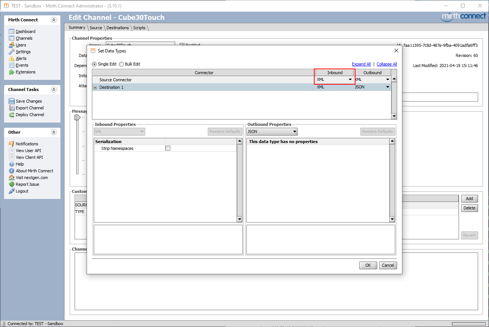
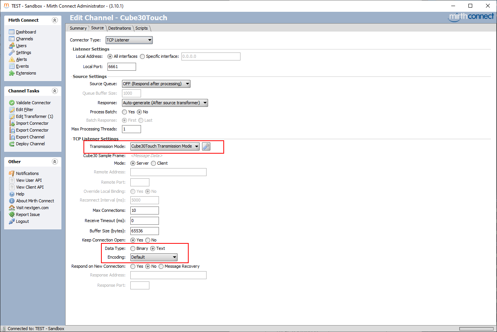

# Cube 30 Touch Transmission mode

A transmission mode provider for [Diesse Cube 30 Touch](https://www.streck.com/products/sed-rate/diesse-cube-30-touch/) erythrocyte sedimentation rate analyzer

---

## Installation
Like any other Mirth plugin

1. Clone repo
1. Run `maven clean package`
1. Get `cube30mode.zip` file from `distribution/target`
1. Drop zip contents into `mirthroot/extensions`
   - **OR**
1. Install through Mirth Connect Administrator
---

## Usage
1. Set Source Connector inbound datatype to `XML`
1. Set Source Connector Type to `TCP Listener`
1. Set transmission mode to `Cube30Touch Transmission Mode`
1. Set TCP Listener data type to `Text` with default encoding. UTF-8 should be fine.

---
## Sample

Incoming hex
```
3e 30 30 32 35 30 31 35 31 30 31 4c 32 30 30 35 30 38 30 31 32 36 30 10 30 38 30 35 32 30 31 34 32 30 20 20 20 30 30 38 30 30 30 30 30 35 0d 34 33 3e 30 30 32 35 30 31 35 31 30 31 4c 31 39 31 31 32 32 30 31 33 36 31 10 31 32 30 35 32 30 31 34 34 30 20 20 36 38 30 30 30 30 30 30 31 38 0d 35 33 
```

Incoming ascii
```
>0025015101L200508012600805201420   008000005
43>0025015101L191122013611205201440  6800000018
53
```

Converted xml
```xml
<cubeFrames>
    <cubeFrame>
        <dataBytesCount>25</dataBytesCount>
        <recordTubesCount>1</recordTubesCount>
        <barcode>L20050801260</barcode>
        <dateTime>2020-05-08T14:20</dateTime>
        <ves>0</ves>
        <flagText>Reading Error</flagText>
        <cycle>5</cycle>
    </cubeFrame>
    <cubeFrame>
        <dataBytesCount>25</dataBytesCount>
        <recordTubesCount>1</recordTubesCount>
        <barcode>L19112201361</barcode>
        <dateTime>2020-05-12T14:40</dateTime>
        <ves>68</ves>
        <cycle>24</cycle>
    </cubeFrame>
</cubeFrames>
```
- If `flagText` element is present then the message is erroneous
- **The plugin rejects frames with invalid checksums!**

---
## Todo
* More simplifycation
* Pass trough all fields and allow user to filter from Source Filters
* Moar settings
  * Level of Rejected frame data message 
* Implement more stuff from the [specification](https://www.diesse.it/en/download/id:13383/)
* Also should probably definitely move to byte iteration for field values instead of the current Regex... 

---
## Notes
- This plugin does not do everything in the specification! As it stands right now it just receives messages and makes a pretty XML of it. The main purpose of this plugin was to simplify checksum calculation.  

---
## Contributing
**Pull requests are always welcome**

---
## Screenshots
##### 1. Datatypes


##### 2. Source connector settings

